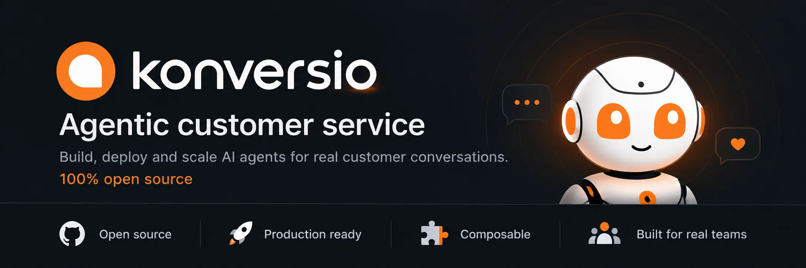

<table width="100%" role="presentation">
  <tr>
    <td align="center" bgcolor="#101116">
      
    </td>
  </tr>
</table>

<p align="center">
  <a href="https://github.com/konversio-org/konversio/tree/konversio-v0.0.3"></a>
  <a href="https://github.com/konversio-org/konversio/archive/refs/tags/konversio-v0.0.3.zip"></a>
  <a href="./LICENSE"></a>
  <a href="https://github.com/konversio-org/konversio/stargazers"></a>
</p>

<p align="center">
  <strong>Customer support your team can own.</strong><br>
  Bring conversations, help content, and an open AI support agent together in a platform you can self-host.<br>
  <a href="https://konversio.org">Website</a> · <a href="https://github.com/konversio-org/konversio/blob/main/CHANGELOG.md#003---2026-10-02">What’s new in 0.0.3</a> · <a href="#run-konversio">Run Konversio</a>
</p>

## Konversio 0.0.3

Konversio is an open-source customer service platform for teams that want control over their support tools and customer data. Version 0.0.3 brings in the user-facing changes from Chatwoot v4.14 through [v4.18.0, released September 18, 2026](https://github.com/chatwoot/chatwoot/releases/tag/v4.18.0), while keeping the included experience available under the MIT license.

- **Pilot AI:** source citations, reply suggestions, conversation outcome tracking, audience and schedule controls, FAQ suggestions, response safeguards, and assistant analytics.
- **Customer channels:** expanded WhatsApp campaigns, templates and calling, voice and video calls, plus imports from Intercom and Freshdesk.
- **Help Center:** a refreshed portal, full-text search, staged article edits, AI-assisted translation, and richer media.
- **Team workflows:** conversation and reporting improvements, company and contact tools, more flexible automation, audit logs, and a guided setup experience.

See the [full 0.0.3 changelog](https://github.com/konversio-org/konversio/blob/main/CHANGELOG.md#003---2026-10-02) for the complete list.

## Run Konversio

Start a local development instance with Docker Compose:

```bash
cp .env.example .env
docker compose up -d
docker compose exec rails bundle exec rails db:chatwoot_prepare
```

Then open the dashboard at [http://localhost:3000](http://localhost:3000).

## Built to be yours

Konversio is MIT-licensed and self-hosted. Pilot uses your chosen model provider with your own credentials, so you decide where the application runs and which AI services process conversations. Your deployment and provider choices determine your data residency and compliance posture.

Konversio is a hard fork of Chatwoot Community Edition v4.13.0. Pilot is Konversio’s independently re-expressed AI integration layer. Original copyright notices and MIT license terms are preserved in [`LICENSE`](./LICENSE).

## Contribute

Issues and pull requests are welcome. Start with the [contribution guide](./CONTRIBUTING.md), or browse the [open issues](https://github.com/konversio-org/konversio/issues).
